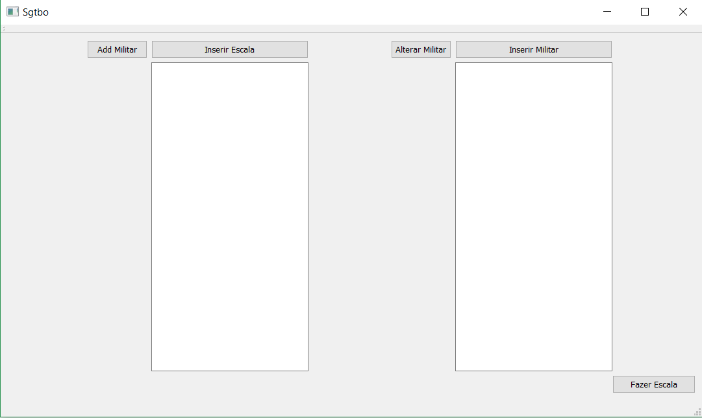

# Projeto:
Robô sargenteante.

# Descrição
  Implementar um programa, software ou aplicativo que faça, o mais automaticamente possível, a escala de serviço de uma companhia.

# Função
  O programa receberia do usuário uma lista de nomes, escalas de serviço (com as características de cada escala), e em que escalas os nomes iriam rodar. O programa então faria uma prévia das escalas de forma a seguir as normas de serviço. O usuário seria então capaz de inserir ocorrências como alunos baixados ou trocas de serviço. Quanto não houver mas nenhuma ocorrência o usuário poderá comandar a exportação da escala definitiva em formato pdf para ser anexado ao aditamento. E o programa ficaria pronto para preparar o próximo período de escalas.

# Motivação
  Fazer a escala de serviço é um processo majoritariamente mecânico que pode vim a custar demasiado tempo de alunos da SE/3 e outras engenharias. Tempo esse que poderia ser gasto estudando, trabalhando em projetos, se desenvolvendo ou mesmo repousando. E algo que a faça automaticamente poderia, assim, fim a contribuir pro desenvolvimento tecnológico do país como um todo. 
  
# Documentação
**Tutorial QT**

O tutorial seguido foi:https://www.youtube.com/watch?v=ImY-H7VJjwE&list=PL0meOoSt675fF8xBzifArQyGwfZ-39SGA&index=2
gerando a seguinte interfarce:

**Esboço GUI**

