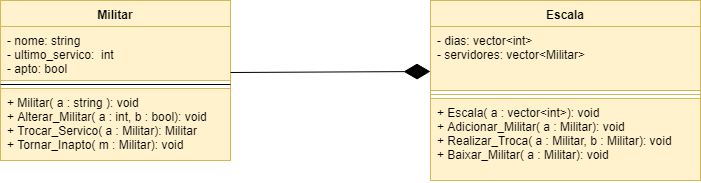

# Projeto:
Robô sargenteante.

# Descrição
  Implementar um programa, software ou aplicativo que faça, o mais automaticamente possível, a escala de serviço de uma companhia.

# Função
  O programa receberia do usuário uma lista de nomes, escalas de serviço (com as características de cada escala), e em que escalas os nomes iriam rodar. O programa então faria uma prévia das escalas de forma a seguir as normas de serviço. O usuário seria então capaz de inserir ocorrências como alunos baixados ou trocas de serviço. Quanto não houver mas nenhuma ocorrência o usuário poderá comandar a exportação da escala definitiva em formato pdf para ser anexado ao aditamento. E o programa ficaria pronto para preparar o próximo período de escalas.

# Motivação
  Fazer a escala de serviço é um processo majoritariamente mecânico que pode vim a custar demasiado tempo de alunos da SE/3 e outras engenharias. Tempo esse que poderia ser gasto estudando, trabalhando em projetos, se desenvolvendo ou mesmo repousando. E algo que a faça automaticamente poderia, assim, fim a contribuir pro desenvolvimento tecnológico do país como um todo. 
  
# Documentação
**Tutorial QT**

O tutorial seguido foi:https://www.youtube.com/watch?v=ImY-H7VJjwE&list=PL0meOoSt675fF8xBzifArQyGwfZ-39SGA&index=2
gerando a seguinte interfarce:

**Fluxograma e Diagrama de Blocos**

**Esboço GUI**

## Instrução de compilação para Windows 10 32-bits

Para compilação do programa na pasta Robo_Sargenteante deste repositóri, foi utilizado QT Creator 4.6.1 com o kit MinGW 5.3.0 , logo será necessário a instalação do mesmo. Assim será precisso a seleção do projeto Robo_Sargenteante.pro que estará incluido os arquivos necessários. Após isso será necessário fazer o *build* do projeto, que será montado em um diretório de acordo com a configuração do QT Creator. Agora utilizando o *QT 5.10.1 for Desktop* deve-se ir a pasta onde o executável foi montado e digitar "windeployqt.exe --quick --no-translations ." o que fará instalar as dependências do executável. Com isso o programa estará pronto para ser executado.

## Como Utilizar 

inicialmente:
nos botões indicados deve-se inserir militares com nome seus nomes de guerra e escalas seus nomes e dias da semana em que elas rodam, então adiciona-se cada militar em suas respectivas escalas no botão Add Militar. (Opicional) se necesário altere os status de algum militar. Terminado as preparções clique em fazer a escala. (Opcional) faça uma troca, baixe algum militar ou export uma prévia. Finalizado clique em finalizar escala para exportar a escala definitiva.
